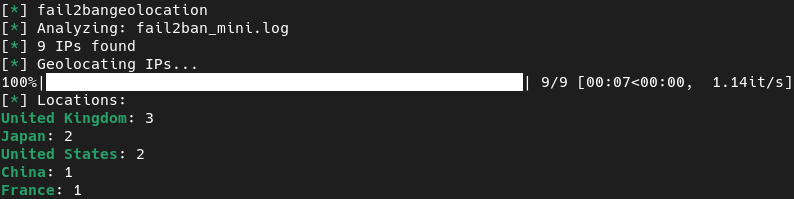
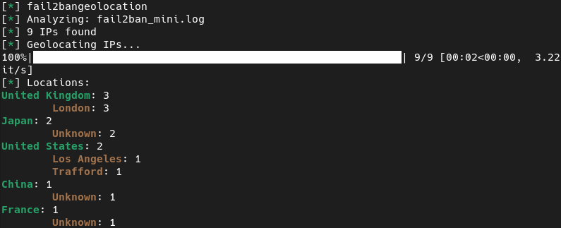

# fail2bangeolocation

Shows geolocation of failed attempts registered by *fail2ban*.  
It's useful to know from which locations you are being attacked the most.  
You can group locations by country or by country and by city.  


## Screenshots

* Grouped by country



* Grouped by country and city


## Requirements

* python3
* fail2ban
* python libraries:
  * setuptools
  * requests
  * tqdm
  * colorama 

## Installation 

You can install *fail2bangeolocation* via *pip3*:

```shell
$ pip3 install fail2bangeolocation
```

You also can run *fail2bangeolocation* directly without installing it, but you need to install the dependencies manually:

```shell
$ sudo pip3 install -r requirements.txt
```

## Usage

* If you installed *fail2bangeolocation* with *pip3* you can run it directly from the command line interface:

  ```shell
  $ fail2bangeolocation [-h] [-c] {fail2ban,log,server}
  ```

* You can run *fail2bangeolocation* without installation running the *fail2bangeolocation.py* script

  ```shell
  $ ./fail2bangeolocation.py [-h] [-c] {fail2ban,log,server}
  ```
  or
  ```shell
  $ python3 fail2bangeolocation.py [-h] [-c] {fail2ban,log,server}
  ```

* *fail2bangeolocation* arguments

  ```shell
  usage: fail2bangeolocation.py [-h] [-c] {fail2ban,log,server} ...
  
  Shows geolocation of failed attempts registered by fail2ban
  
  positional arguments:
    {fail2ban,log,server}
                          These options are mutually exclusive
      fail2ban            analyze all banned IPs by fail2ban
      log                 analyze a fail2ban log file. Use "log -h" to see more options
      server              analyze all banned IPs by fail2ban (e.g. "server sshd")
  
  optional arguments:
    -h, --help            show this help message and exit
    -c, --show-city       group IPs by country and city 
  ```

* ### Analyze all IPs registered by fail2ban 

  :warning: Requires root privileges  

  Run *fail2bangeolocation* using the *fail2ban* argument:

  ```shell
  $ sudo fail2bangeolocation fail2ban
  ```

* ### Analyze all IPs registered by fail2ban for a given jailed server/service, e.g. sshd 

  :warning: Requires root privileges  
  Run *fail2bangeolocation* with the *server* argument and the jailed server name:

  ```shell
  $ sudo fail2bangeolocation server sshd
  ```

* ### Analyze a log file
  :warning: May require root privileges depending on the file to be analyzed  
  Run *fail2bangeolocation* with the *log* argument and the path to the log file:

  ```shell
  $ fail2bangeolocation log /var/log/fai2ban.log
  ```

  You can also geolocate the unbanned IPs contained in the log adding the **-u** argument:

  ```shell
  $ fail2bangeolocation log -u /var/log/fai2ban.log
  ```
  
* ### Group the output by country and city
  Run *fail2bangeolocation* with "**-c**" as first argument:

  ```shell
  $ fail2bangeolocation -c {fail2ban,log,server}
  ```
  
## Troubleshooting

In case of any problem create an [issue](https://github.com/rubenhortas/fail2bangeolocation/issues/new)

## Discussions
If you want ask (or answer) a question, leave an opinion or have an open-ended conversation you can create (or join) a [discussion](https://github.com/rubenhortas/fail2bangeolocation/discussions/new)

## Support

If you find this application useful you can star this repo.
